# Architecture

This document describes the system architecture of Stick Rumble, a real-time multiplayer arena shooter with a server-authoritative design.

## System Overview

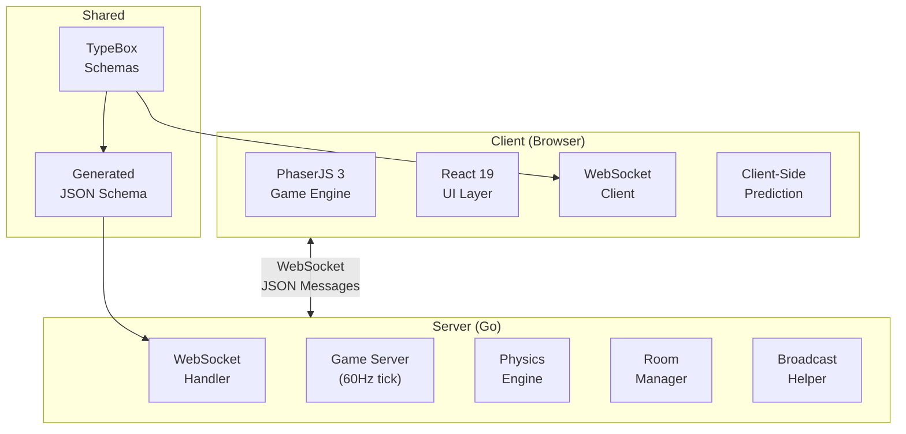

## Server-Authoritative Model

All game state is computed on the server. Clients are "dumb terminals" that:
1. Send inputs (WASD, mouse position, shoot requests)
2. Receive authoritative state updates
3. Render what the server tells them

This prevents cheating—clients cannot lie about their position, health, or damage dealt.

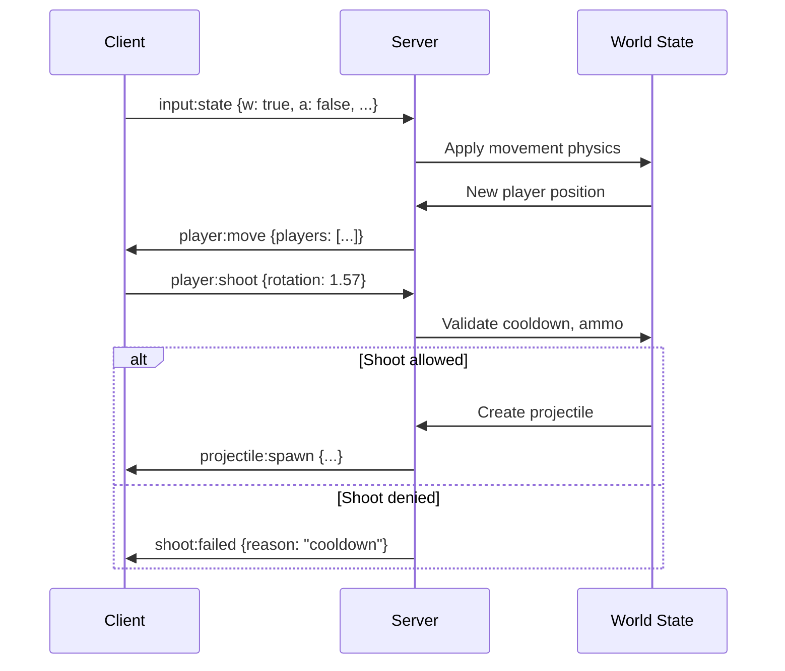

## Data Flow

### Game Loop (Server)

The server runs a 60Hz physics tick loop and broadcasts player state at 20Hz:

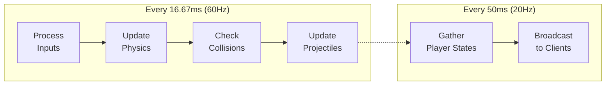

### Message Flow

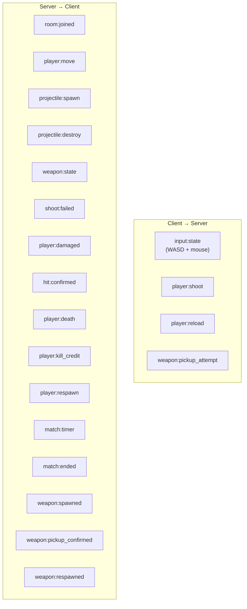

## Component Architecture

### Client Components

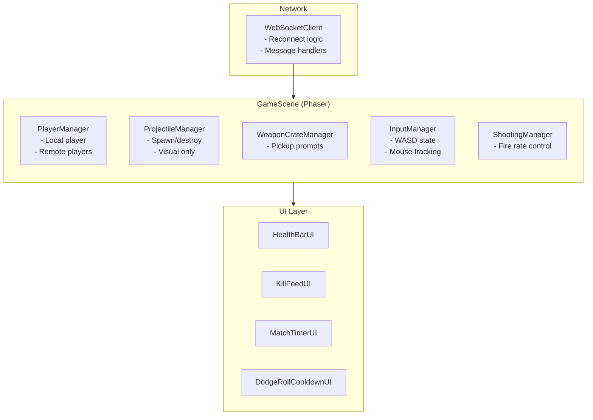

### Server Components

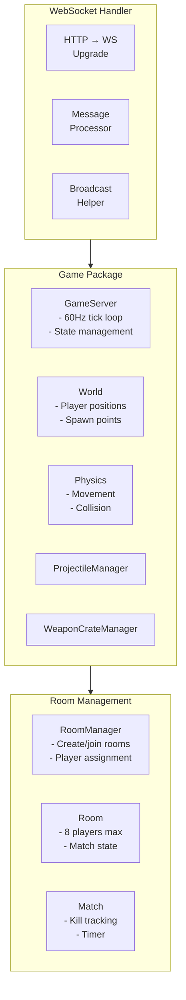

## WebSocket Protocol

### Message Format

All messages follow this structure:

```typescript
interface Message {
  type: string;      // e.g., "player:move", "input:state"
  timestamp: number; // Unix milliseconds
  data?: unknown;    // Type-specific payload
}
```

### Schema Validation

Schemas are defined in TypeScript using TypeBox, then compiled to JSON Schema for Go validation:

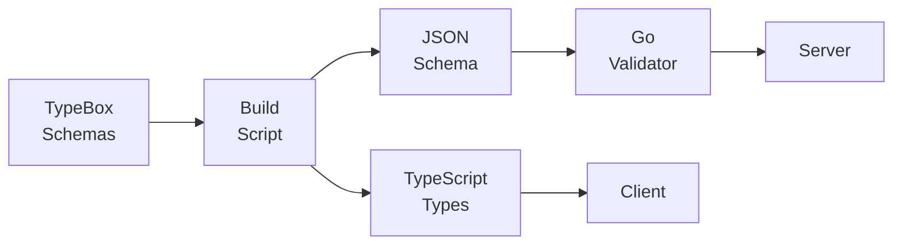

### Message Types

| Direction | Type | Purpose |
|-----------|------|---------|
| C→S | `input:state` | WASD input + mouse position |
| C→S | `player:shoot` | Fire weapon request |
| C→S | `player:reload` | Reload weapon request |
| C→S | `weapon:pickup_attempt` | Pick up weapon crate |
| S→C | `room:joined` | Player assigned to room |
| S→C | `player:move` | All player positions (20Hz) |
| S→C | `projectile:spawn` | New projectile created |
| S→C | `projectile:destroy` | Projectile removed |
| S→C | `weapon:state` | Ammo count, reload status |
| S→C | `shoot:failed` | Why shoot was rejected |
| S→C | `player:damaged` | Health reduced |
| S→C | `hit:confirmed` | You hit someone |
| S→C | `player:death` | Player died |
| S→C | `player:kill_credit` | You killed someone |
| S→C | `player:respawn` | Player respawned |
| S→C | `match:timer` | Time remaining |
| S→C | `match:ended` | Match results |
| S→C | `weapon:spawned` | Weapon crate appeared |
| S→C | `weapon:pickup_confirmed` | Pickup successful |
| S→C | `weapon:respawned` | Crate respawned |

## Room Management

Players are automatically assigned to rooms:

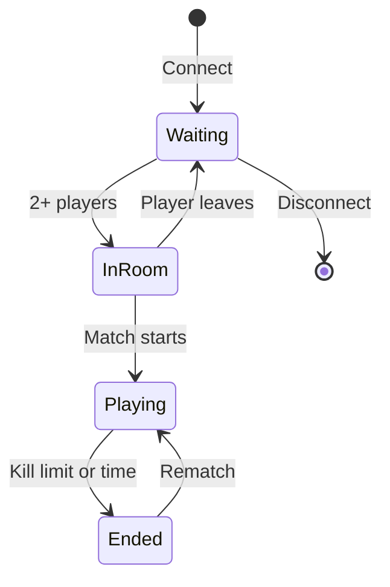

### Room Lifecycle

1. **Connect**: Player establishes WebSocket connection
2. **Waiting**: Player waits for opponents (room needs 2+ players)
3. **Room Created**: RoomManager creates room, assigns players
4. **Match Active**: GameServer runs physics, broadcasts state
5. **Match End**: Kill limit reached or time expires
6. **Cleanup**: Players removed on disconnect, empty rooms destroyed

## Physics System

The server physics engine handles:

- **Movement**: Velocity-based with friction
- **Collision**: AABB against world boundaries
- **Projectiles**: Ray-based hit detection
- **Spawn Points**: Random selection from predefined positions

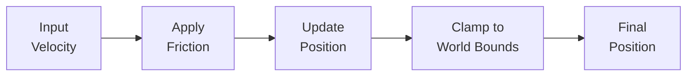

## Weapon System

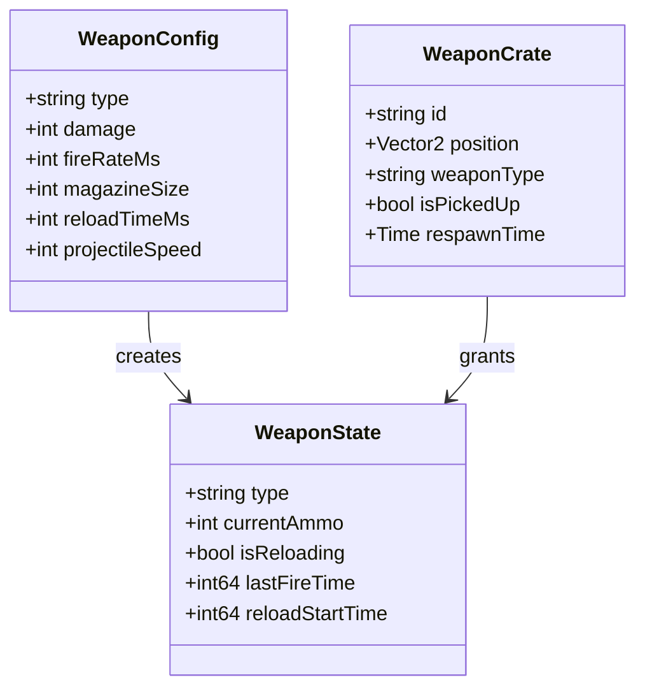

### Available Weapons

| Weapon | Damage | Fire Rate | Magazine | Reload |
|--------|--------|-----------|----------|--------|
| Pistol | 15 | 400ms | 12 | 1500ms |
| Uzi | 10 | 80ms | 30 | 2000ms |
| Shotgun | 8×6 | 800ms | 6 | 2500ms |
| AK47 | 20 | 120ms | 30 | 2500ms |
| Bat | 35 | 500ms | ∞ | - |
| Katana | 50 | 600ms | ∞ | - |

## Error Handling

### Client Reconnection

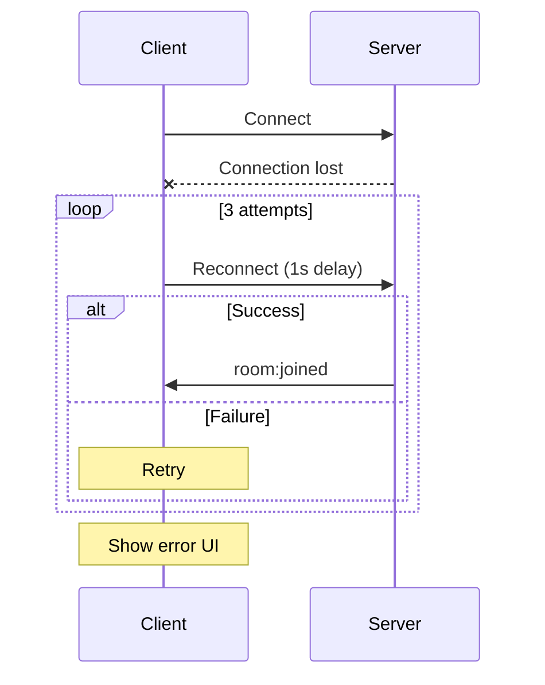

### Graceful Shutdown

Server handles SIGTERM/SIGINT with 30-second timeout:

1. Stop accepting new connections
2. Notify connected clients
3. Wait for in-flight messages
4. Close all connections
5. Exit cleanly
