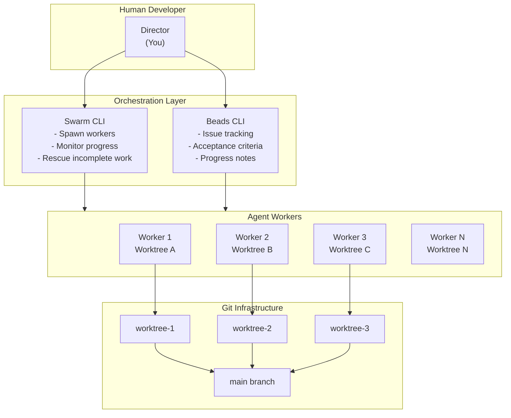
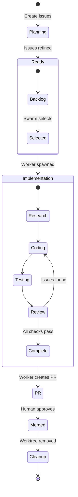
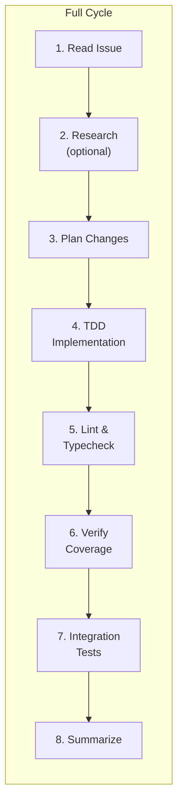

# Multi-Agent Development Workflow

This document describes the AI-assisted development system used to build Stick Rumble, demonstrating how multiple Claude Code agents can work in parallel on complex software projects.

## Overview



## Core Components

### Beads - Issue Tracking

Beads is a local-first issue tracker stored in `.beads/issues.jsonl`. Each issue contains:

- **Title and description**
- **Acceptance criteria** - Specific requirements for completion
- **Status** - `ready`, `in_progress`, `review`, `closed`
- **Priority** - P1 (critical) through P4 (low)
- **Progress notes** - Log of work done

```bash
# View available work
bd ready

# Show issue details
bd show {id}

# Update status
bd update {id} --status in_progress

# Add progress notes
bd update {id} --notes "Implemented core logic, tests passing"

# Close with summary
bd close {id} --reason "Implementation complete, PR created"

# Sync to git
bd sync
```

### Swarm - Agent Orchestration

Swarm manages multiple Claude Code agents running in isolated git worktrees:

```bash
# List active workers
swarm ls

# Spawn a worker
swarm spawn \
  --name issue-abc \
  --tmux \
  --worktree \
  --ready-wait \
  -- claude --dangerously-skip-permissions \
  "/beads:full-cycle id=abc research=false"

# Check worker logs
swarm logs issue-abc | tail -40

# Send message to stuck worker
swarm send issue-abc "Continue with implementation"

# Kill a worker
swarm kill issue-abc

# Clean up stopped workers
swarm clean --all
```

### Git Worktrees - Isolation

Each worker operates in its own git worktree, preventing conflicts:

```
/home/user/code/stick-rumble/           # Main working directory
/home/user/code/stick-rumble-worktrees/
├── issue-abc/                          # Worker 1's isolated copy
├── issue-def/                          # Worker 2's isolated copy
└── issue-ghi/                          # Worker 3's isolated copy
```

## Workflow Phases



### Phase 1: Issue Creation

Issues are created from epics or user stories:

```bash
/beads:create-tasks
```

Each issue includes:
- Clear acceptance criteria
- Technical context
- Dependencies identified

### Phase 2: Worker Spawning

The Swarm Director selects independent issues and spawns workers:

```bash
/swarm:director
```

Workers are spawned with:
1. **Isolated worktree** - No conflicts with other workers
2. **Full Claude Code session** - Access to all tools
3. **Beads context** - Issue details and acceptance criteria

### Phase 3: Implementation (Per Worker)

Each worker follows the `/beads:full-cycle` workflow:



#### TDD Implementation

Workers follow test-driven development:

1. Write failing test for acceptance criteria
2. Implement minimum code to pass
3. Refactor while keeping tests green
4. Repeat until all criteria met

#### Quality Gates

Every worker must pass:
- **Unit tests** - `make test`
- **Type checking** - `make typecheck`
- **Linting** - `make lint`
- **Coverage** - >90% statement coverage

### Phase 4: Code Review

Workers can self-review or be reviewed by other agents:

```bash
/beads:review id={id}
/beads:review-tests id={id}
```

Review checks:
- Code matches acceptance criteria
- Tests have meaningful assertions
- No security vulnerabilities
- Follows project patterns

### Phase 5: PR Creation

Workers push to remote and create PRs:

```bash
git push -u origin HEAD
gh pr create --title "..." --body "..."
```

PR body includes:
- Summary of changes
- Test plan
- Link to Beads issue

### Phase 6: Cleanup

After PR is merged:

```bash
/swarm:director action=cleanup
```

This:
1. Removes merged worktrees
2. Deletes merged branches
3. Prunes remote references
4. Syncs Beads database

## Parallel Execution Example

```mermaid
gantt
    title Parallel Agent Execution
    dateFormat HH:mm
    axisFormat %H:%M

    section Worker 1
    Issue ABC Research    :w1r, 00:00, 5m
    Issue ABC Implement   :w1i, after w1r, 15m
    Issue ABC Tests       :w1t, after w1i, 10m
    Issue ABC PR          :w1p, after w1t, 2m

    section Worker 2
    Issue DEF Research    :w2r, 00:00, 3m
    Issue DEF Implement   :w2i, after w2r, 20m
    Issue DEF Tests       :w2t, after w2i, 8m
    Issue DEF PR          :w2p, after w2t, 2m

    section Worker 3
    Issue GHI Research    :w3r, 00:00, 4m
    Issue GHI Implement   :w3i, after w3r, 12m
    Issue GHI Tests       :w3t, after w3i, 6m
    Issue GHI PR          :w3p, after w3t, 2m

    section Director
    Monitor Progress      :d1, 00:10, 5m
    Rescue Worker 2       :d2, 00:25, 3m
    Final Review          :d3, 00:35, 5m
```



## Handling Failures

### Stuck Workers

Workers can get stuck in loops or make wrong assumptions. The director can nudge them:

```bash
# Check if worker is stuck
swarm logs issue-abc | tail -40

# Send helpful message
swarm send issue-abc "Focus on the failing test first"
swarm send issue-abc "The API endpoint changed to /api/v2/users"
swarm send issue-abc "Skip the flaky test and proceed"
```

### Incomplete Work

If a worker stops before completing:

```bash
# Check what's missing
bd show {id}
git -C {worktree-path} status

# Option 1: Spawn new worker to finish
swarm spawn --name {id}-rescue ...

# Option 2: Director finishes manually
cd {worktree-path}
# ... complete remaining work
git push
gh pr create
```

### Merge Conflicts

Workers on isolated worktrees rarely conflict, but when they do:

1. Merge main into the problematic branch
2. Resolve conflicts
3. Push and update PR

## Best Practices

### Issue Selection

- **Choose independent issues** - No dependencies between parallel workers
- **Balance complexity** - Mix quick fixes with larger tasks
- **Limit concurrency** - 2-3 workers is easier to monitor than 8

### Monitoring

- **Check frequently** - Every 30-60 seconds during active work
- **Read logs** - `swarm logs {name} | tail -40`
- **Check Beads** - `bd show {id}` for progress notes

### Quality Assurance

- **Require coverage** - >90% statement coverage
- **Run all tests** - `make test` before PR
- **Visual verification** - `make test-visual` for UI changes

## Commands Reference

| Command | Purpose |
|---------|---------|
| `bd ready` | Show available work |
| `bd show {id}` | Issue details |
| `bd update {id} --status ...` | Change status |
| `bd close {id} --reason ...` | Close issue |
| `bd sync` | Sync to git |
| `swarm ls` | List workers |
| `swarm spawn ...` | Start worker |
| `swarm logs {name}` | View output |
| `swarm send {name} "..."` | Send message |
| `swarm kill {name}` | Stop worker |
| `swarm clean --all` | Remove stopped |
| `git worktree list` | Show worktrees |
| `git worktree remove {path}` | Delete worktree |

## Why This Approach Works

### For Complex Systems

Real-time multiplayer games have:
- **Concurrent state** - Multiple players, projectiles, events
- **Timing sensitivity** - 60Hz physics, 20Hz broadcasts
- **Cross-language coordination** - TypeScript client, Go server
- **Visual correctness** - Rendering must match game state

AI agents can handle this complexity when given:
1. Clear acceptance criteria
2. Comprehensive test infrastructure
3. Isolated execution environments
4. Human oversight for course correction

### For Learning New Languages

This project involved learning Go while building a production system. The AI workflow enables this by:

1. **Pattern recognition** - Agents identify idioms from existing code
2. **Test-driven learning** - Tests define expected behavior
3. **Incremental progress** - Small, verified changes
4. **Knowledge capture** - CLAUDE.md documents patterns

### Philosophy

> *"If the system can handle real-time multiplayer game development, it can handle anything."*

By choosing the hardest possible domain—real-time multiplayer with unfamiliar languages—we prove the workflow's robustness for simpler projects.
