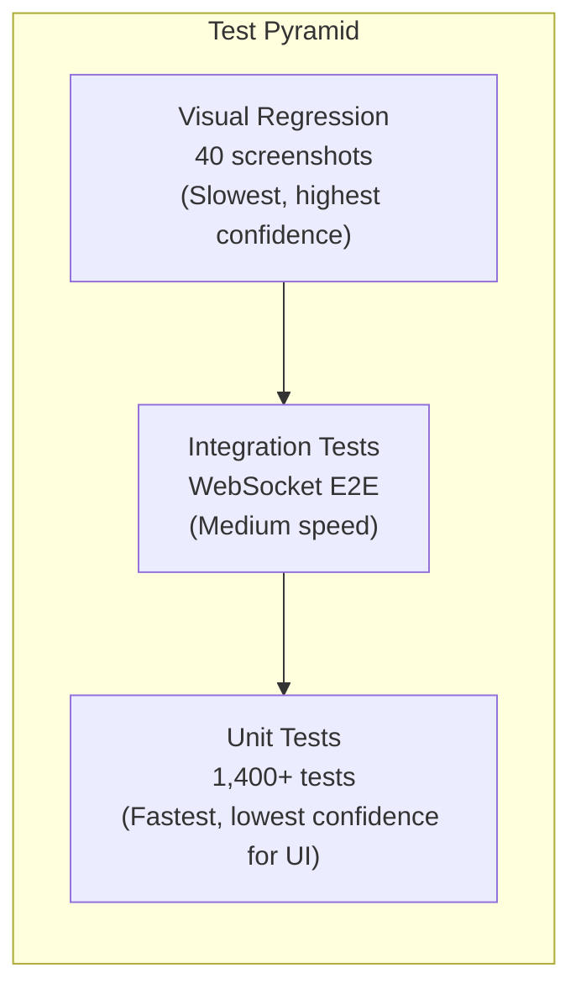
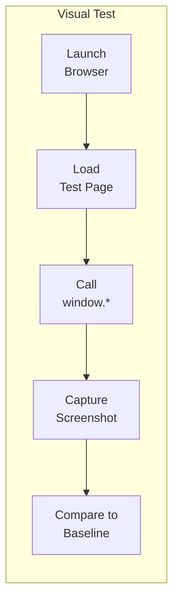
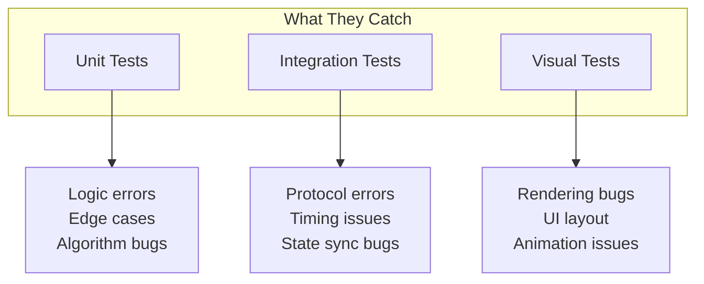
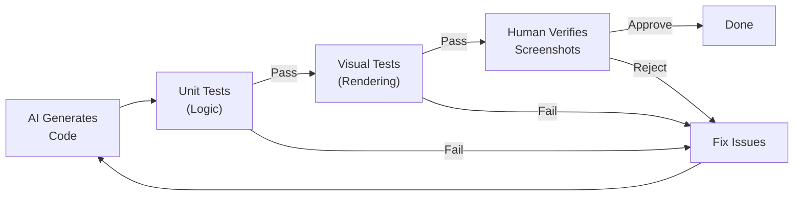
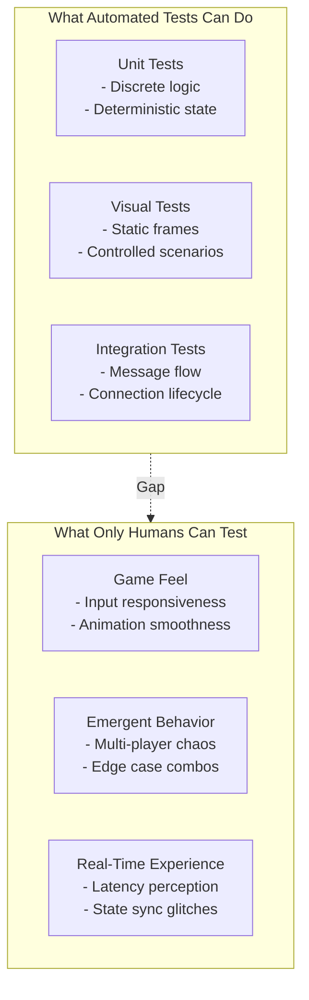
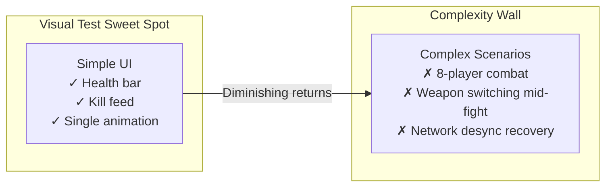
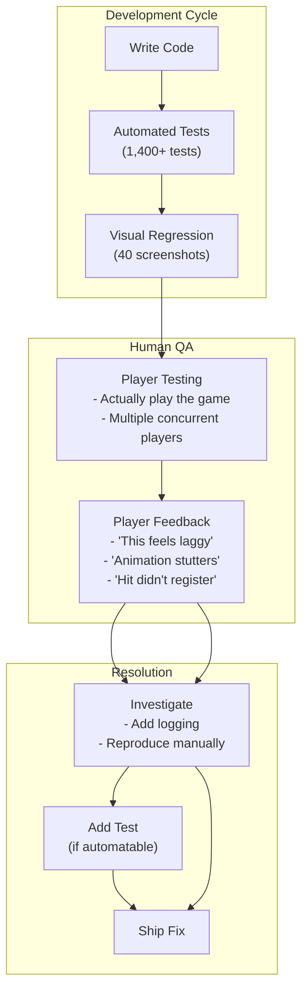
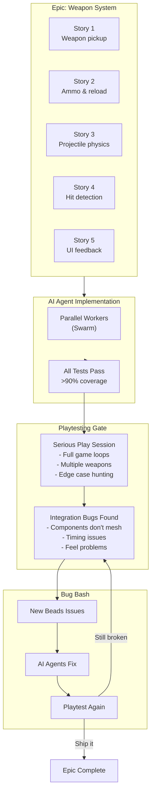

# Testing Strategy

This document describes the comprehensive validation infrastructure used to verify AI-generated code for Stick Rumble—a graphical, real-time multiplayer system where traditional unit tests alone are insufficient.

## The Challenge

AI-generated code faces unique validation challenges:

1. **Mocked rendering** - Unit tests verify function calls, not pixels on screen
2. **Timing sensitivity** - 60Hz game loops expose subtle bugs
3. **State complexity** - Multiplayer state synchronization is hard to test
4. **Visual correctness** - A passing test doesn't mean correct rendering

## Testing Pyramid



| Layer | Count | Purpose | Catches |
|-------|-------|---------|---------|
| Unit | 1,400+ | Logic verification | Algorithm bugs, edge cases |
| Integration | ~50 | System communication | Protocol errors, timing issues |
| Visual | 40 | Rendering correctness | UI bugs, rendering failures |

## Unit Tests

### Client (Vitest)

```bash
make test-client           # Run once
npm run test:watch         # Interactive mode
npm run test:coverage      # With coverage report
```

**Structure:**
```
stick-rumble-client/src/
├── game/
│   ├── entities/
│   │   ├── PlayerManager.ts
│   │   └── PlayerManager.test.ts      # Colocated tests
│   ├── scenes/
│   │   ├── GameScene.ts
│   │   └── GameScene.test.setup.ts    # Shared setup
│   └── ...
└── tests/
    └── __mocks__/                      # Phaser mocks
```

**Coverage requirements:**
- >90% statement coverage for all business logic
- All edge cases covered
- All error paths tested

### Server (Go)

```bash
make test-server           # Run all
make test-server-verbose   # With output
go test ./internal/game -v -run TestName  # Single test
```

**Structure:**
```
stick-rumble-server/internal/
├── game/
│   ├── gameserver.go
│   ├── gameserver_tick_test.go
│   ├── gameserver_shooting_test.go
│   └── ...
└── network/
    ├── websocket_handler.go
    └── websocket_handler_test.go
```

**Testing patterns:**
- Table-driven tests for edge cases
- Mock clocks for timing-sensitive code
- In-memory channels for WebSocket simulation

## Integration Tests

Integration tests verify client-server communication over real WebSocket connections.

```bash
make test-integration      # Auto-starts server
```

**What they test:**
- Connection establishment and reconnection
- Message serialization/deserialization
- State synchronization
- Error handling

**Example: Health regeneration test**
```typescript
// WebSocketClient.health-regeneration.integration.test.ts
it('should receive health updates after damage', async () => {
  // Connect to real server
  const client = new WebSocketClient('ws://localhost:8080/ws');
  await client.connect();

  // Take damage (server-side)
  // ...

  // Verify health regeneration messages
  await expect(client).toReceiveMessage({
    type: 'player:damaged',
    data: { health: expect.any(Number) }
  });
});
```

## Visual Regression Tests

**The critical insight**: Unit tests mock the rendering engine. A test like `expect(graphics.arc).toHaveBeenCalled()` passes even if nothing renders on screen.

Visual regression tests run a real browser with real Phaser rendering. Screenshots capture actual pixels.



### Running Visual Tests

```bash
# Install Playwright (first time)
make test-visual-install

# Run tests
make test-visual

# Update baselines after fixing bugs
make test-visual-update
```

### Test Harness Architecture

```
stick-rumble-client/
├── public/
│   └── ui-test-entities.html     # Test harness page
├── src/
│   └── entity-test-scene.ts      # Exposes window.* functions
└── tests/
    ├── visual/                    # Playwright specs
    │   ├── player-sprites.spec.ts
    │   ├── melee-animation.spec.ts
    │   └── ...
    └── screenshots/               # Baseline images (committed)
        ├── health-bar.spec.ts/
        ├── kill-feed.spec.ts/
        └── ...
```

### Test Scene API

The entity test scene exposes functions for Playwright to call:

```typescript
// entity-test-scene.ts
declare global {
  interface Window {
    spawnPlayer: (id: string, x: number, y: number) => void;
    removePlayer: (id: string) => void;
    damagePlayer: (id: string, amount: number) => void;
    triggerMeleeAttack: (id: string) => void;
    advanceFrames: (count: number) => void;
    restartScene: () => void;
    // ... more functions
  }
}
```

### Example Visual Test

```typescript
// health-bar.spec.ts
import { test, expect } from '@playwright/test';

test('health bar shows correct fill at 50%', async ({ page }) => {
  await page.goto('http://localhost:5173/ui-test-entities.html');
  await page.waitForFunction(() => window.gameReady);

  // Spawn player at full health
  await page.evaluate(() => window.spawnPlayer('test', 400, 300));

  // Damage to 50%
  await page.evaluate(() => window.damagePlayer('test', 50));

  // Wait for render
  await page.evaluate(() => window.advanceFrames(2));

  // Screenshot and compare
  await expect(page).toHaveScreenshot('health-bar-50-percent.png');
});
```

### When to Update Baselines

Update baselines when:
1. **Bug fix** - The old screenshot showed incorrect rendering
2. **Intentional change** - Design updated, new assets added
3. **New feature** - Adding new visual tests

**Never update baselines** without visually verifying the new screenshot is correct.

### Verifying Screenshots

After updating baselines, use Claude Code's Read tool to visually verify:

```bash
# Update baselines
make test-visual-update

# Then in Claude Code conversation:
# "Read the screenshot at stick-rumble-client/tests/screenshots/health-bar.spec.ts/..."
```

Claude can see images and verify they show correct rendering.

## Coverage Requirements

| Component | Minimum Coverage |
|-----------|------------------|
| Client business logic | 90% statement |
| Server game logic | 90% statement |
| Network handlers | 90% statement |
| Visual regression | All UI components |

### Measuring Coverage

```bash
# Client coverage
npm run test:coverage

# Server coverage
go test ./... -coverprofile=coverage.out
go tool cover -html=coverage.out
```

## Test Categories

### By Speed

| Category | Time | When to Run |
|----------|------|-------------|
| Unit | <30s | Every change |
| Integration | ~2min | Before commit |
| Visual | ~5min | Before PR |

### By Purpose



## CI/CD Integration

All tests run in CI before merge:

```yaml
# Conceptual CI pipeline
jobs:
  test:
    steps:
      - make lint          # Code quality
      - make typecheck     # Type safety
      - make test-client   # Client unit tests
      - make test-server   # Server unit tests
      - make test-visual   # Visual regression
```

## Common Testing Patterns

### Mock Clock Pattern (Server)

```go
// Inject mock clock for deterministic timing
func TestFireRate(t *testing.T) {
    mockClock := &MockClock{now: time.Now()}
    server := NewGameServerWithClock(broadcast, mockClock)

    // Fire first shot
    result := server.Shoot(playerID, rotation)
    assert.True(t, result.Success)

    // Advance time less than cooldown
    mockClock.Advance(100 * time.Millisecond)

    // Should be on cooldown
    result = server.Shoot(playerID, rotation)
    assert.False(t, result.Success)
    assert.Equal(t, "cooldown", result.Reason)
}
```

### Mock WebSocket Pattern (Client)

```typescript
// Mock WebSocket for unit tests
const mockWs = {
  send: vi.fn(),
  close: vi.fn(),
  readyState: WebSocket.OPEN,
};

vi.stubGlobal('WebSocket', vi.fn(() => mockWs));

const client = new WebSocketClient('ws://localhost:8080/ws');
await client.connect();

// Verify message sent
client.sendInput({ w: true, a: false, s: false, d: false });
expect(mockWs.send).toHaveBeenCalledWith(
  expect.stringContaining('"type":"input:state"')
);
```

### Visual Test Isolation

```typescript
// Each visual test starts with clean scene
test.beforeEach(async ({ page }) => {
  await page.goto('http://localhost:5173/ui-test-entities.html');
  await page.waitForFunction(() => window.gameReady);
  await page.evaluate(() => window.restartScene());
});
```

## Debugging Test Failures

### Unit Test Failures

```bash
# Run single test with verbose output
npm test -- --reporter=verbose PlayerManager.test.ts
go test ./internal/game -v -run TestSpecificFunction
```

### Integration Test Failures

```bash
# Start server with debug logging
DEBUG=true make dev-server

# Run integration test
npm run test:integration -- WebSocketClient.integration.test.ts
```

### Visual Test Failures

1. Check the diff image in `test-results/`
2. Use `make test-visual-update` to capture new baseline
3. **Read the new screenshot** to verify correctness
4. Commit only if the new screenshot is correct

## Philosophy

### Why Visual Tests Matter Most for AI

When AI generates rendering code, it can:
- Call the right functions in the wrong order
- Pass incorrect parameters that still type-check
- Create logic that "works" but renders incorrectly

Unit tests catch logic errors. Visual tests catch rendering errors.

### The Feedback Loop



This creates a tight feedback loop where AI-generated code is verified at multiple levels before being accepted.

## The Limits of Automated Testing

### Why Human Playtesting Remains Essential

Despite 1,400+ automated tests and visual regression infrastructure, **human playtesting is often the only way to catch certain classes of bugs** in real-time multiplayer games.



### The Real-Time Problem

AI agents (including LLMs) have fundamental limitations when testing real-time systems:

| Challenge | Why It's Hard for AI |
|-----------|---------------------|
| **60Hz game loops** | AI can't perceive or react at 16ms intervals |
| **Input timing** | Precise WASD + mouse coordination requires human reflexes |
| **Latency feel** | Subjective experience of "lag" isn't measurable by code |
| **Animation smoothness** | Frame-by-frame screenshots miss interpolation issues |
| **Emergent gameplay** | 8 players creating chaos produces untestable combinations |

### Visual Test Complexity Ceiling

Visual regression tests work well for:
- Static UI components (health bars, kill feeds)
- Predictable animations (melee swings with `advanceFrames()`)
- Isolated entity rendering

But they struggle with:
- **Complex state combinations** - Testing every weapon × every player state × every UI element creates combinatorial explosion
- **Animation interpolation** - Screenshots capture frames, not the smoothness between them
- **Dynamic multiplayer scenarios** - 8 players moving, shooting, dying simultaneously
- **Network-induced artifacts** - Rubber-banding, prediction errors, desync



### The Pragmatic Solution: Player Feedback Loop

When automated tests pass but something still feels wrong, **human playtesting is the final arbiter**:



### What Human Testers Catch

Real examples of bugs that only human playtesting revealed:

1. **"Shooting feels unresponsive"** - Fire rate technically correct, but visual/audio feedback delayed by 2 frames
2. **"Players teleport sometimes"** - State sync working correctly, but interpolation had edge case at high velocity
3. **"Can't tell when I'm hit"** - Damage numbers rendering, but screen shake too subtle during combat chaos
4. **"Weapon pickup is frustrating"** - Proximity detection correct, but pickup prompt obscured by other UI

These bugs pass all automated tests because:
- The code is technically correct
- Individual components render properly
- Messages flow as expected
- Coverage is >90%

But the **holistic experience** is broken in ways only a human player perceives.

### Epic-Based Development with Playtesting Gates

The practical workflow integrates playtesting at the **epic level**, not per-story:



**Why epic-level playtesting?**

Individual stories pass their tests in isolation. But when Story 1 (weapon pickup) meets Story 4 (hit detection) meets Story 5 (UI feedback), **integration seams appear**:

- Pickup animation interrupts shooting state machine
- Hit detection uses old weapon stats after switch
- UI shows wrong ammo count during reload-cancel edge case

These bugs are **invisible to per-story testing** because each component works correctly in isolation. Only when a human plays through full game loops—picking up weapons, shooting enemies, dying, respawning—do the integration misses surface.

### The Playtesting Session

After completing an epic with AI agents:

1. **Block off real time** - Not 5 minutes, but 30-60 minutes of actual gameplay
2. **Play the full loop** - Don't just test new features; play the whole game
3. **Take notes** - "Felt weird when..." is valid bug report data
4. **Hunt edge cases** - Spam inputs, switch weapons mid-reload, die while shooting
5. **Multi-client testing** - Run 2-4 game clients simultaneously

### Integrating Human Feedback

The workflow acknowledges this reality:

1. **Automated tests** gate code quality and catch regressions
2. **Visual tests** verify rendering correctness for testable scenarios
3. **Epic completion** triggers a dedicated playtesting session
4. **Player feedback** becomes new issues in Beads for the next cycle

```bash
# After playtesting an epic reveals integration issues
bd create --title "Weapon switch interrupts reload state" \
  --description "Switching weapons during reload leaves player unable to fire" \
  --priority P1

bd create --title "Hit feedback missing on rapid fire" \
  --description "When Uzi fires fast, some hits don't show damage numbers" \
  --priority P2

# AI agents fix the integration bugs
/swarm:director issues=abc,def

# Playtest again to verify fixes
```

This creates a **rhythm**: build epic → playtest → bug bash → playtest → ship. The AI handles the implementation volume; humans validate the integrated experience.

### The Honest Truth

> **No amount of automated testing replaces playing your own game.**

AI-assisted development accelerates implementation. Automated tests prevent regressions. Visual tests catch rendering bugs. But for real-time multiplayer games, the final quality gate is—and always will be—humans playing the game and reporting what feels wrong.

This isn't a limitation to overcome. It's a recognition that games are experiential products, and experience is inherently human.
