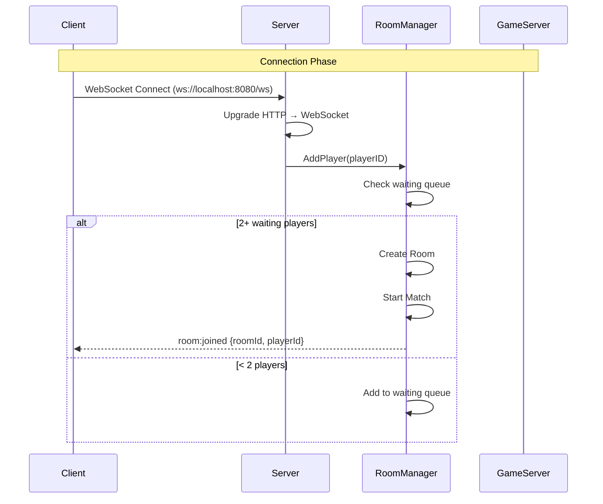
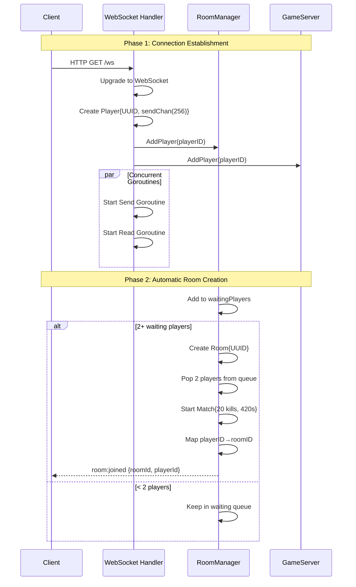
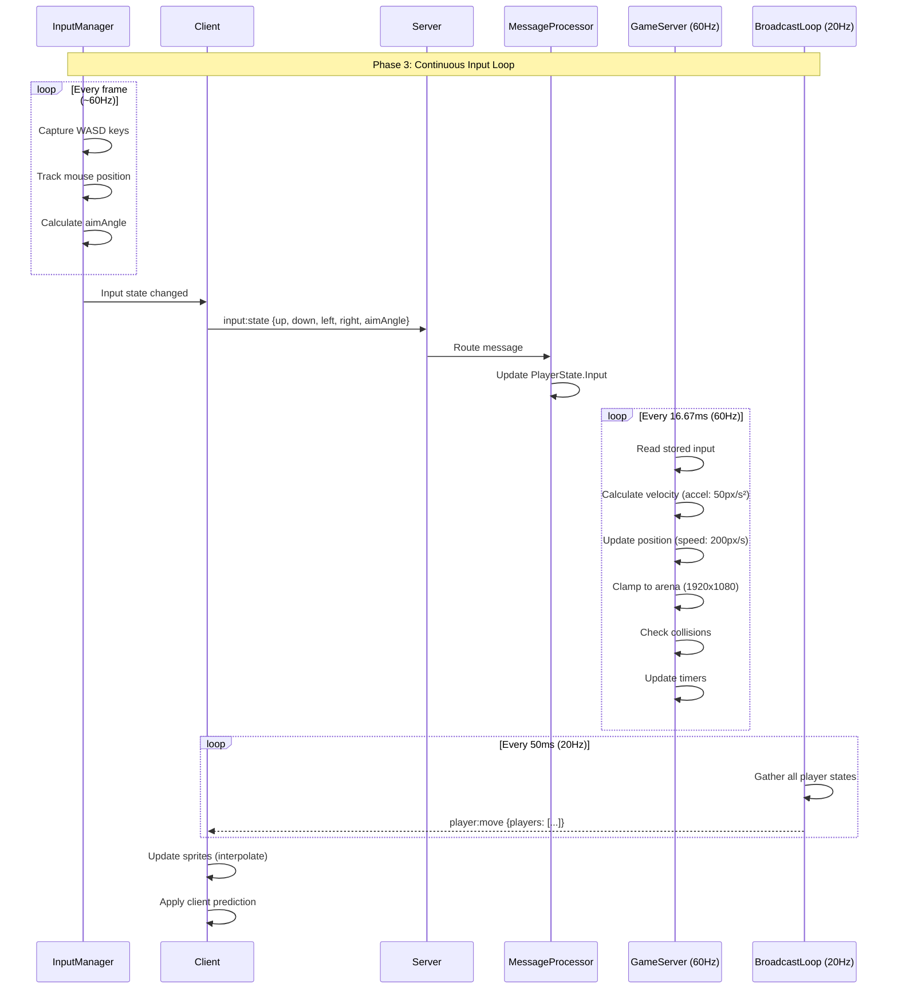
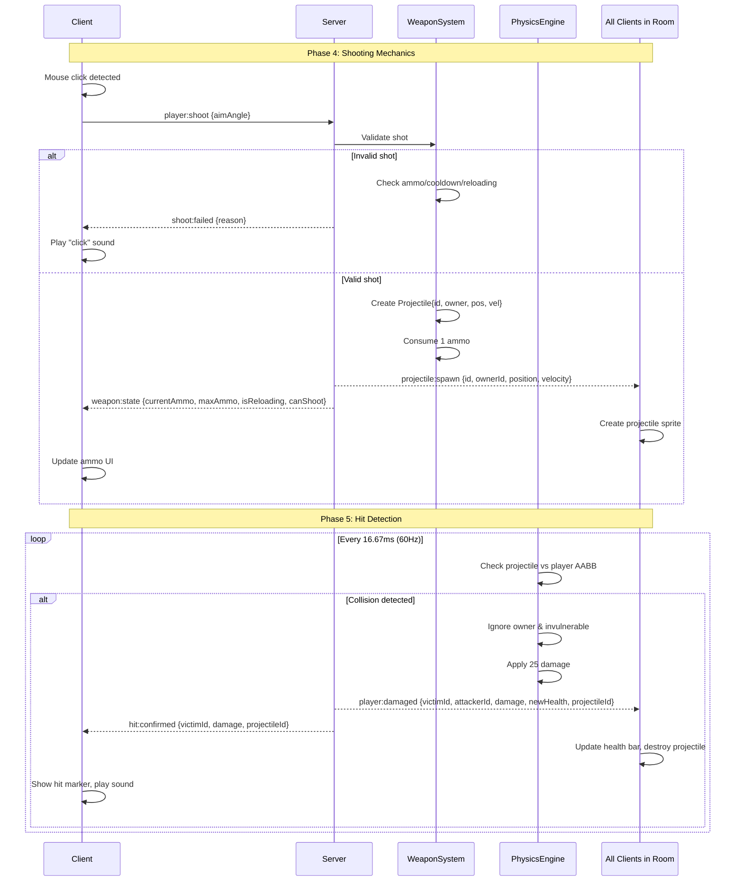
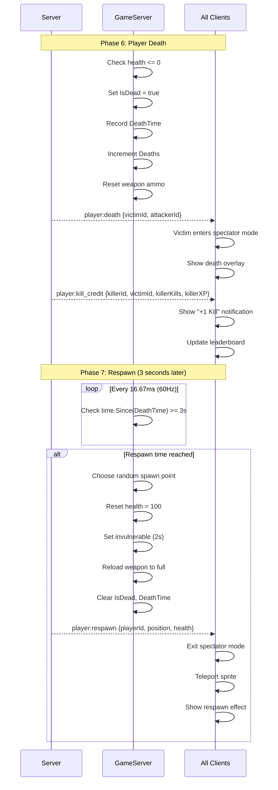
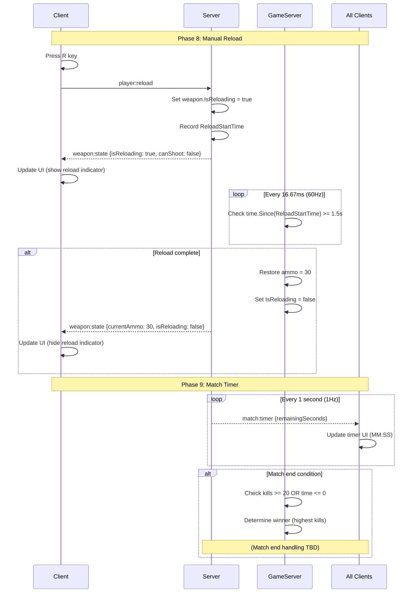
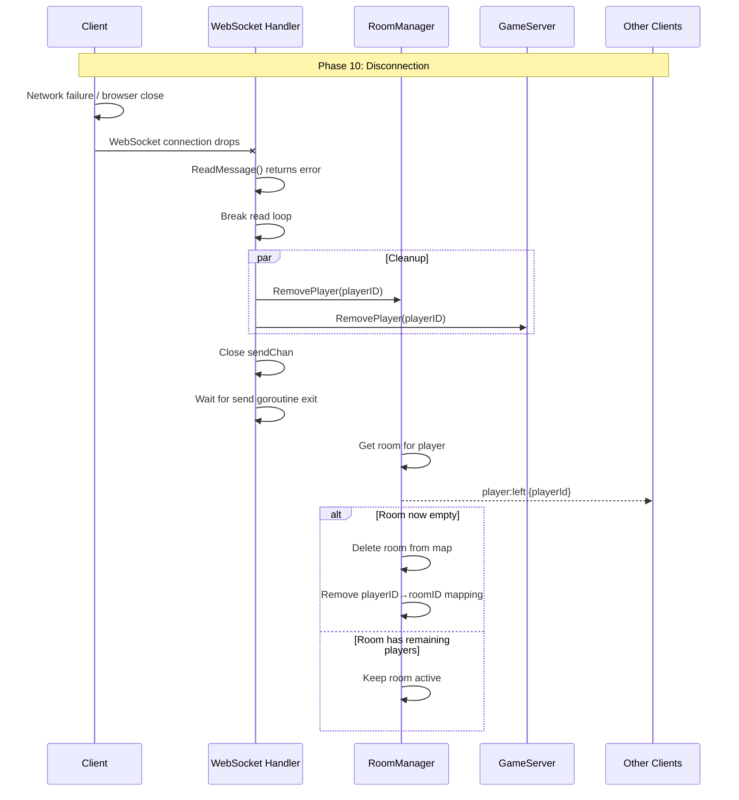
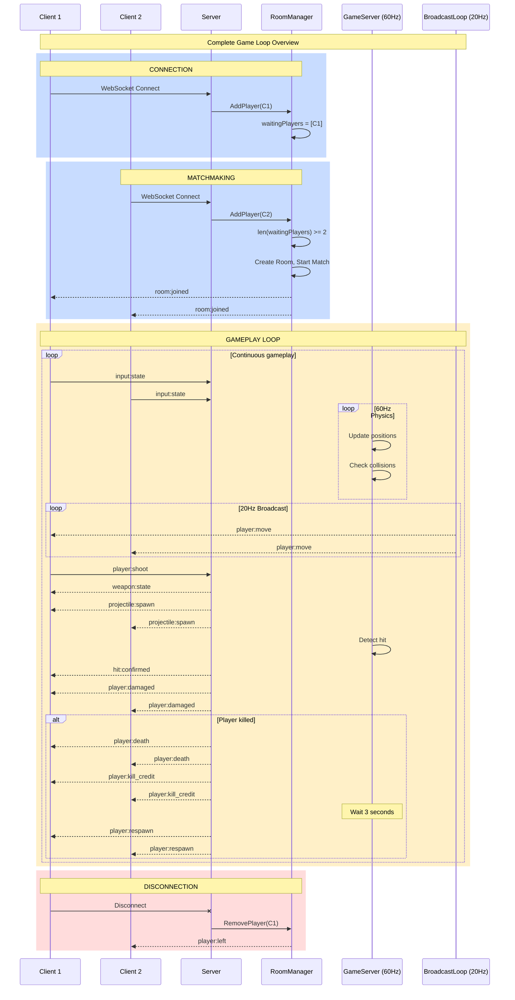

# Research: WebSocket Event Sequence for Mermaid Diagram

**Date**: 2025-12-07
**Researcher**: Claude Code

## Research Question
What are all the WebSocket events and their sequence flow needed to build a comprehensive Mermaid sequence diagram for the Stick Rumble multiplayer game?

## Summary
The Stick Rumble WebSocket architecture follows a server-authoritative model with 15 distinct message types exchanged between client and server. The event flow spans six phases: Connection Establishment, Room Assignment, Input/Movement, Shooting/Combat, Death/Respawn, and Disconnection. The server uses dual-loop architecture (60Hz physics tick + 20Hz broadcast) with automatic room creation when 2+ players are waiting.

## Detailed Findings

### Connection & Room Assignment Flow

#### Phase 1: Initial Connection
1. **Client initiates connection** - `WebSocketClient.ts:37`
   - Connects to `ws://localhost:8080/ws` (configurable via VITE_WS_URL)
   - Promise-based connection with auto-reconnect (3 attempts, exponential backoff: 1s, 2s, 4s)

2. **Server upgrades HTTP to WebSocket** - `websocket_handler.go:109`
   - Uses gorilla/websocket upgrader with CheckOrigin allowing all origins (dev mode)

3. **Server creates Player entity** - `websocket_handler.go:116-124`
   - Generates UUID for player
   - Creates buffered send channel (capacity: 256)
   - Initializes Player struct

4. **Server registers player** - `websocket_handler.go:129-132`
   - Adds to RoomManager (triggers room creation logic)
   - Adds to GameServer for physics simulation

5. **Server spawns goroutines** - `websocket_handler.go:136-189`
   - Send goroutine: Reads from sendChan → writes to WebSocket
   - Read goroutine: Reads from WebSocket → routes messages

#### Phase 2: Automatic Room Creation
6. **RoomManager checks waiting queue** - `room.go:136-179`
   - Player added to `waitingPlayers` slice
   - If `len(waitingPlayers) >= 2`:
     - Creates new Room with UUID
     - Pops first 2 players from queue
     - Starts Match with config (20 kills, 420 seconds)
     - Maps playerID → roomID for both

7. **Server broadcasts `room:joined`** - `room.go:171-172`
   ```json
   {
     "type": "room:joined",
     "timestamp": 1234567890,
     "data": {
       "roomId": "uuid-string",
       "playerId": "uuid-string"
     }
   }
   ```

8. **Client receives room assignment** - `GameSceneEventHandlers.ts:89-99`
   - Stores playerId in local state
   - Identifies "local player" for rendering

### Input & Movement Flow

#### Phase 3: Continuous Input Loop

9. **Client captures input** - `InputManager.ts:79-85, 117`
   - Listens for WASD key events
   - Tracks mouse position for aim angle calculation
   - Updates internal input state (60Hz)

10. **Client sends `input:state`** - `InputManager.ts:163-167`
    - Triggered on input change (not every frame)
    - Optimized to reduce network traffic
    ```json
    {
      "type": "input:state",
      "timestamp": 1234567890,
      "data": {
        "up": false,
        "down": false,
        "left": true,
        "right": false,
        "aimAngle": 1.57
      }
    }
    ```

11. **Server receives and stores input** - `message_processor.go:11-32`
    - Routes to `handleInputState()`
    - Updates `PlayerState.Input` struct
    - Does NOT broadcast (server-authoritative)

12. **Server physics tick (60Hz)** - `gameserver.go:96-134`
    - Reads stored input state
    - Calculates velocity with acceleration (50 px/s²)
    - Updates position (speed: 200 px/s)
    - Clamps to arena bounds (1920x1080)
    - Checks projectile collisions
    - Updates timers (reload, invulnerability, respawn)

13. **Server broadcast loop (20Hz)** - `gameserver.go:136-158`
    - Gathers all player states from World
    - Calls broadcast callback

14. **Server broadcasts `player:move`** - `broadcast_helper.go:12-63`
    - Sends to all players in room
    ```json
    {
      "type": "player:move",
      "timestamp": 1234567890,
      "data": {
        "players": [
          {
            "id": "uuid",
            "position": {"x": 500, "y": 300},
            "velocity": {"x": 150, "y": 0},
            "aimAngle": 1.57,
            "health": 100,
            "isInvulnerable": false,
            "deathTime": null,
            "kills": 5,
            "deaths": 2,
            "xp": 150
          }
        ]
      }
    }
    ```

15. **Client updates sprites** - `PlayerManager.ts:86-173`
    - `handlePlayerMove()` updates all player positions
    - Interpolates movement for smoothness
    - Applies client-side prediction for local player
    - Updates health bars, aim indicators

### Shooting & Combat Flow

#### Phase 4: Shooting Mechanics

16. **Client detects mouse click** - `GameScene.ts:114`
    - Pointer down event on game canvas

17. **Client sends `player:shoot`** - `ShootingManager.ts:61-67`
    ```json
    {
      "type": "player:shoot",
      "timestamp": 1234567890,
      "data": {
        "aimAngle": 1.57
      }
    }
    ```

18. **Server validates shot** - `gameserver.go:231-279`
    - Routes to `HandlePlayerShoot()`
    - Checks weapon state (ammo, cooldown, reloading)
    - If invalid: Sends `shoot:failed` with reason

19a. **Server sends `shoot:failed`** (if invalid) - `broadcast_helper.go:168-198`
    ```json
    {
      "type": "shoot:failed",
      "timestamp": 1234567890,
      "data": {
        "reason": "empty" | "cooldown" | "reloading" | "no_player"
      }
    }
    ```
    - **Client handles** - `GameSceneEventHandlers.ts:129-135`
    - Plays "click" sound, shows feedback

19b. **Server creates projectile** (if valid) - `gameserver.go:265-270`
    - Spawns Projectile entity
    - Sets position, velocity, owner
    - Consumes 1 ammo

20. **Server broadcasts `projectile:spawn`** - `broadcast_helper.go:65-86`
    ```json
    {
      "type": "projectile:spawn",
      "timestamp": 1234567890,
      "data": {
        "id": "proj-uuid",
        "ownerId": "player-uuid",
        "position": {"x": 500, "y": 300},
        "velocity": {"x": 800, "y": 0}
      }
    }
    ```
    - **Client handles** - `GameSceneEventHandlers.ts:102-111`
    - Creates projectile sprite, starts physics

21. **Server sends `weapon:state`** (to shooter only) - `broadcast_helper.go:127-166`
    ```json
    {
      "type": "weapon:state",
      "timestamp": 1234567890,
      "data": {
        "currentAmmo": 29,
        "maxAmmo": 30,
        "isReloading": false,
        "canShoot": true
      }
    }
    ```
    - **Client handles** - `GameSceneEventHandlers.ts:120-126`
    - Updates ammo UI counter

#### Phase 5: Hit Detection

22. **Server physics checks collision** - `gameserver.go:122`
    - Every tick (60Hz) checks projectile vs player AABB
    - Ignores owner and invulnerable players

23. **Server broadcasts `player:damaged`** - `message_processor.go:93-115`
    ```json
    {
      "type": "player:damaged",
      "timestamp": 1234567890,
      "data": {
        "victimId": "victim-uuid",
        "attackerId": "attacker-uuid",
        "damage": 25,
        "newHealth": 75,
        "projectileId": "proj-uuid"
      }
    }
    ```
    - **Client handles** - `GameSceneEventHandlers.ts:138-159`
    - Victim: Updates health bar, plays hurt sound
    - Destroys projectile sprite

24. **Server sends `hit:confirmed`** (to attacker only) - `message_processor.go:117-135`
    ```json
    {
      "type": "hit:confirmed",
      "timestamp": 1234567890,
      "data": {
        "victimId": "victim-uuid",
        "damage": 25,
        "projectileId": "proj-uuid"
      }
    }
    ```
    - **Client handles** - `GameSceneEventHandlers.ts:162-171`
    - Shows hit marker, plays hit sound

### Death & Respawn Flow

#### Phase 6: Player Death

25. **Server checks health <= 0** - `message_processor.go:137`
    - After damage applied

26. **Server marks player dead** - `message_processor.go:139`
    - Sets `IsDead = true`
    - Records `DeathTime = time.Now()`
    - Increments `Deaths` counter
    - Resets weapon ammo

27. **Server broadcasts `player:death`** - `message_processor.go:149-166`
    ```json
    {
      "type": "player:death",
      "timestamp": 1234567890,
      "data": {
        "victimId": "victim-uuid",
        "attackerId": "attacker-uuid"
      }
    }
    ```
    - **Client handles** - `GameSceneEventHandlers.ts:174-185`
    - Victim: Enters spectator mode (camera follows killer)
    - Shows death overlay

28. **Server broadcasts `player:kill_credit`** - `message_processor.go:169-188`
    ```json
    {
      "type": "player:kill_credit",
      "timestamp": 1234567890,
      "data": {
        "killerId": "killer-uuid",
        "victimId": "victim-uuid",
        "killerKills": 6,
        "killerXP": 180
      }
    }
    ```
    - **Client handles** - `GameSceneEventHandlers.ts:188-199`
    - Killer: Shows "+1 Kill" notification
    - Updates leaderboard

#### Phase 7: Respawn

29. **Server respawn check (60Hz)** - `gameserver.go:404`
    - Checks if `time.Since(DeathTime) >= 3 seconds`
    - Only for dead players

30. **Server respawns player** - `message_processor.go:203-226`
    - Chooses random spawn point
    - Resets health to 100
    - Sets invulnerable for 2 seconds
    - Reloads weapon to full ammo
    - Clears `IsDead` and `DeathTime`

31. **Server broadcasts `player:respawn`** - `message_processor.go:216-225`
    ```json
    {
      "type": "player:respawn",
      "timestamp": 1234567890,
      "data": {
        "playerId": "player-uuid",
        "position": {"x": 960, "y": 540},
        "health": 100
      }
    }
    ```
    - **Client handles** - `GameSceneEventHandlers.ts:202-219`
    - Exits spectator mode
    - Teleports player sprite
    - Shows respawn effect

### Reload Flow

#### Phase 8: Manual Reload

32. **Client presses R key** - `ShootingManager.ts:88-91`
    - Sends `player:reload`
    ```json
    {
      "type": "player:reload",
      "timestamp": 1234567890
    }
    ```

33. **Server starts reload** - `message_processor.go:60-68`
    - Sets `weapon.IsReloading = true`
    - Records `ReloadStartTime`

34. **Server sends `weapon:state`** - Same as step 21
    - `isReloading: true, canShoot: false`

35. **Server completes reload (60Hz check)** - `gameserver.go:371-391`
    - Checks if `time.Since(ReloadStartTime) >= 1.5 seconds`
    - Restores ammo to max (30)
    - Sets `IsReloading = false`

36. **Server sends `weapon:state`** - Same as step 21
    - `currentAmmo: 30, isReloading: false`

### Match Timer Flow

#### Phase 9: Match Progression

37. **Server broadcasts `match:timer` (1Hz)** - `broadcast_helper.go:88-125`
    ```json
    {
      "type": "match:timer",
      "timestamp": 1234567890,
      "data": {
        "remainingSeconds": 380
      }
    }
    ```
    - **Client handles** - `GameSceneEventHandlers.ts:222-225`
    - Updates timer UI (MM:SS format)

38. **Match end conditions** - `match.go`
    - Kill target reached (20 kills) OR
    - Time limit reached (420 seconds / 7 minutes)
    - Winner determined by highest kills

### Disconnection Flow

#### Phase 10: Cleanup

39. **Client disconnects**
    - Network failure, browser close, or manual disconnect
    - WebSocket connection drops

40. **Server exits read loop** - `websocket_handler.go:156`
    - ReadMessage returns error
    - Breaks out of message loop

41. **Server cleanup** - `websocket_handler.go:191-198`
    - Removes from RoomManager
    - Removes from GameServer
    - Closes send channel
    - Waits for send goroutine exit

42. **Server broadcasts `player:left`** - `room.go:242-256`
    ```json
    {
      "type": "player:left",
      "timestamp": 1234567890,
      "data": {
        "playerId": "player-uuid"
      }
    }
    ```
    - Legacy message (no explicit client handler)

43. **Server room cleanup** - `room.go:261-265`
    - If room empty: Deletes room from RoomManager
    - Removes player-to-room mapping

## Complete Message Type Reference

### Client → Server (3 types)

| Message Type | Frequency | Handler | Purpose |
|-------------|-----------|---------|---------|
| `input:state` | On change (~60Hz) | `message_processor.go:11` | WASD + aim angle |
| `player:shoot` | On click | `message_processor.go:34` | Fire weapon |
| `player:reload` | On R key | `message_processor.go:60` | Reload weapon |

### Server → Client (12 types)

| Message Type | Frequency | Broadcast Scope | Purpose |
|-------------|-----------|-----------------|---------|
| `room:joined` | On room assign | Individual | Confirm room + playerId |
| `player:move` | 20Hz | Room | All player positions/states |
| `projectile:spawn` | On shoot | Room | New projectile created |
| `weapon:state` | On shoot/reload | Individual | Ammo count, reload status |
| `shoot:failed` | On invalid shot | Individual | Error feedback |
| `player:damaged` | On hit | Room | Damage dealt to player |
| `hit:confirmed` | On hit | Individual (attacker) | Hit marker feedback |
| `player:death` | On death | Room | Player killed |
| `player:kill_credit` | On kill | Room | Leaderboard update |
| `player:respawn` | After 3s death | Room | Player returns |
| `match:timer` | 1Hz | Room | Countdown timer |
| `player:left` | On disconnect | Room | Player disconnected |

## Architecture Insights

### Server-Authoritative Design
- **Client sends input only**, never position
- **Server computes physics** (60Hz tick rate)
- **Server validates all actions** (shooting, damage, kills)
- **Client renders interpolated state** (20Hz updates)
- **Prevents cheating** (speed hacks, wall hacks, aimbot)

### Performance Optimizations
1. **Input throttling**: Only send when state changes, not every frame
2. **Broadcast rate limiting**: 20Hz updates vs 60Hz physics
3. **Buffered channels**: 256-message capacity prevents blocking
4. **Goroutines per connection**: Concurrent read/write
5. **Message batching**: `player:move` includes all players in one message

### Thread Safety
- **RoomManager**: Protected by `sync.RWMutex`
- **GameServer**: Lock-free (single goroutine)
- **WebSocket writes**: Synchronized via send channel
- **Player state**: Accessed only by game loop

### Fault Tolerance
1. **Reconnect logic**: 3 attempts with exponential backoff
2. **Buffer overflow**: Drops messages with warning (non-blocking)
3. **Graceful shutdown**: 30s timeout for connection cleanup
4. **Room cleanup**: Auto-delete empty rooms
5. **Waiting queue**: Players wait for match if solo

## Code References

### Client Files
- `stick-rumble-client/src/game/network/WebSocketClient.ts:1-213` - WebSocket wrapper, reconnect logic
- `stick-rumble-client/src/game/scenes/GameScene.ts:1-170` - Main game scene, input routing
- `stick-rumble-client/src/game/scenes/GameSceneEventHandlers.ts:1-230` - Message handler registration
- `stick-rumble-client/src/game/input/InputManager.ts:1-200` - WASD + mouse input capture
- `stick-rumble-client/src/game/input/ShootingManager.ts:1-120` - Shooting + reload logic
- `stick-rumble-client/src/game/entities/PlayerManager.ts:1-250` - Player sprite rendering
- `stick-rumble-client/src/shared/constants.ts:1-50` - Shared game constants

### Server Files
- `stick-rumble-server/internal/network/websocket_handler.go:1-198` - Connection lifecycle
- `stick-rumble-server/internal/network/message_processor.go:1-230` - Message routing and handlers
- `stick-rumble-server/internal/network/broadcast_helper.go:1-200` - Broadcasting utilities
- `stick-rumble-server/internal/game/room.go:1-266` - Room management, auto-creation
- `stick-rumble-server/internal/game/gameserver.go:1-450` - Physics loop, broadcast loop
- `stick-rumble-server/internal/game/player.go:1-100` - Player state struct
- `stick-rumble-server/internal/game/physics.go:1-200` - Physics calculations
- `stick-rumble-server/internal/game/world.go:1-150` - World state management
- `stick-rumble-server/internal/game/weapon.go:1-100` - Weapon mechanics
- `stick-rumble-server/internal/game/projectile.go:1-80` - Projectile system
- `stick-rumble-server/internal/game/match.go:1-120` - Match state, win conditions
- `stick-rumble-server/internal/game/constants.go:1-50` - Game constants
- `stick-rumble-server/cmd/server/main.go:1-100` - Server entry point

## Mermaid Diagram Construction Guide

### Recommended Diagram Structure

For a comprehensive sequence diagram, consider creating **multiple focused diagrams** rather than one massive diagram:

#### Diagram 1: Connection & Room Assignment
- Actors: Client, Server, RoomManager
- Flow: Connect → Upgrade → Create Player → Queue → Create Room → Send room:joined

#### Diagram 2: Input & Movement Loop
- Actors: Client, InputManager, Server, GameServer, BroadcastLoop
- Flow: Input → Send input:state → Physics Tick → Broadcast player:move → Update Sprites

#### Diagram 3: Shooting & Combat
- Actors: Client, Server, WeaponSystem, PhysicsEngine
- Flow: Click → Send player:shoot → Validate → Spawn Projectile → Collision → Damage

#### Diagram 4: Death & Respawn
- Actors: Server, GameServer, All Clients
- Flow: Health Check → Mark Dead → Broadcast death → Wait 3s → Respawn → Broadcast respawn

#### Diagram 5: Disconnection & Cleanup
- Actors: Client, Server, RoomManager, GameServer
- Flow: Disconnect → Exit Loops → Remove Player → Broadcast player:left → Delete Room

### Key Mermaid Syntax Patterns



### Message Format Convention

For consistency, show messages in this format:
```
C->>S: input:state {up, down, left, right, aimAngle}
S-->>C: player:move {players: [...]}
```

Use `-->>` for responses/broadcasts to distinguish from requests.

## Open Questions

1. **Match end handling**: No explicit `match:end` message found. How is match conclusion communicated?
   - Likely handled by `match:timer` reaching 0 or checking `player:kill_credit` for win threshold

2. **Spectator camera**: Client implementation of spectator mode camera following is mentioned but not detailed
   - Located in `GameSceneEventHandlers.ts:183` but needs further investigation

3. **Client-side prediction**: Mentioned in player movement but implementation details not fully documented
   - Likely in `PlayerManager.ts` interpolation logic

4. **Leaderboard updates**: `player:kill_credit` triggers updates but full leaderboard sync mechanism not detailed
   - May be computed client-side from `player:move` data

5. **Room capacity scaling**: Fixed at 8 players, but no auto-scaling for multiple rooms with >16 players waiting
   - Current logic creates one room per 2 players, could create multiple rooms simultaneously

## Mermaid Sequence Diagrams

### Diagram 1: Connection & Room Assignment



### Diagram 2: Input & Movement Loop



### Diagram 3: Shooting & Combat Flow



### Diagram 4: Death & Respawn Flow



### Diagram 5: Reload & Timer Flow



### Diagram 6: Disconnection & Cleanup



### Complete System Overview



## Conclusion

The WebSocket event system is well-architected with clear separation of concerns:
- **3 client-initiated events** (input, shoot, reload)
- **12 server-broadcast events** (state, feedback, notifications)
- **10 distinct phases** from connection to cleanup
- **Dual-loop architecture** (60Hz physics, 20Hz broadcast)
- **Server-authoritative validation** preventing client-side cheating

The message flow is optimized for performance with input throttling, broadcast rate limiting, and buffered channels. The automatic room creation system elegantly handles matchmaking without explicit lobby management.

The Mermaid diagrams above provide both focused views of each phase and a complete system overview, making it easy to understand the full event sequence from connection to disconnection.
